<div align="center">


<br>



<br><br>

<a href="https://www.linkedin.com/in/ioannis-bourmpoulas-81a981373/">
  
</a>
<a href="https://github.com/JohnBourmpoulas">
  
</a>


</div>

## `> about_me.ts`

```ts
const ioannis = {
  name: "Ioannis Bourmpoulas",
  location: "Greece",
  focus: ["Robotics", "Artificial Intelligence", "Embedded Systems"],

  building: [
    "Software",
    "Embedded systems",
    "Intelligent machines"
  ],

  technologies: {
    programming: ["Python", "Java", "C++", "Dart", "PHP"],
    embedded: ["Raspberry Pi", "Arduino"],
    systems: ["Linux", "Git", "GitHub"],
    tools: ["VS Code"]
  },

  interests: [
    "Robotics",
    "AI",
    "Automation",
    "Hardware / software integration"
  ],

  currentMission:
    "Build intelligent systems that connect software with the physical world."
};
```

## `> tech_stack`

<div align="center">


</div>

<br>

## `> language_telemetry`

<div align="center">


</div>

<br>

## `> contributions`

<div align="center">


</div>

<br>

## `> system_footer`

<div align="center">


</div>
