<div align="center">


<br>



<br><br>

<a href="https://www.linkedin.com/in/ioannis-bourmpoulas-81a981373/">
  
</a>
<a href="https://github.com/JohnBourmpoulas">
  
</a>

</div>

## `> about_me.ts`

```ts
const ioannis = {
  role: "Information & Communication Systems Engineer",
  focus: "Robotics Software & Intelligent Systems",

  direction: [
    "Robotics Software Development",
    "Artificial Intelligence",
    "Autonomous Systems"
  ],

  interests: [
    "ROS 2",
    "Computer Vision",
    "Large Language Models",
    "Embedded Systems",
    "3D Modeling & 3D Printing"
  ],

  currentlyExploring: [
    "Robotics Software Development",
    "ROS 2",
    "Autonomous Systems",
    "AI for Robotics"
  ],

  approach: {
    build: "Turn ideas into working prototypes",
    test: "See what works — and what doesn't",
    learn: "Learn through building and experimentation",
    improve: "Iterate, refine, and build it better"
  },

  mission:
    "Bring software, AI and hardware together to build intelligent real-world systems."
};
```

## `> core_stack`

<div align="center">


</div>

<br>

## `> language_telemetry`

<div align="center">


</div>

<br>

## `> activity_signal`

<div align="center">


</div>

<br>

<div align="center">


</div>
