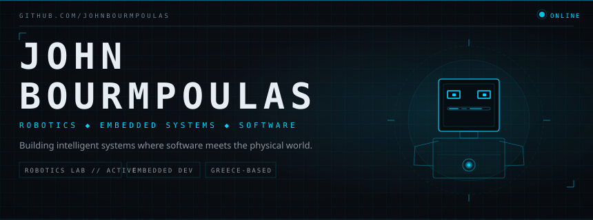

<div align="center">
  
</div>

<br/>

## `// SYSTEM PROFILE`

```text
NAME      : John Bourmpoulas
FOCUS     : Robotics / Embedded Systems / Software
LOCATION  : Greece
STATUS    : Building • Learning • Experimenting
```

I’m interested in building systems that connect **software with the physical world** — robotics, embedded development, automation and intelligent machines.

---

## `// CORE SYSTEMS`

<p align="center">
  
</p>

---

## `// FEATURED MISSION`

### Petoi Robot Cat Nybble
**Robotics • Python • Raspberry Pi • Hardware / Software Integration**

Experimenting with robotic movement, control and embedded computing using the Petoi Nybble platform.

---

## `// GITHUB TELEMETRY`

<p align="center">
  
  
</p>

---

<div align="center">

`BUILD // TEST // ITERATE // DEPLOY`

</div>
